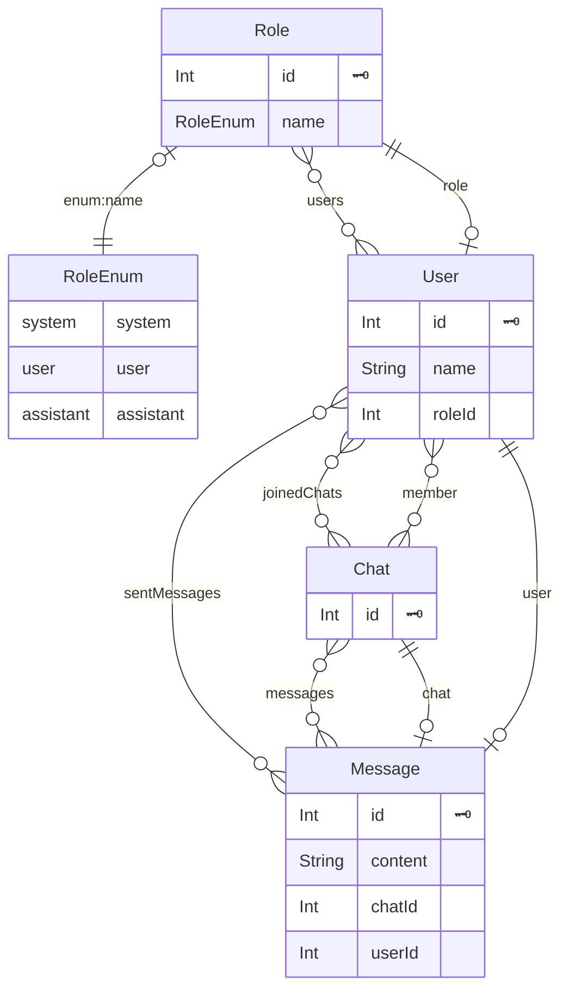

```mermaid
erDiagram

        RoleEnum {
            system system
user user
assistant assistant
        }
    
  "Role" {
    Int id "🗝️"
    RoleEnum name 
    }
  

  "User" {
    Int id "🗝️"
    String name 
    Int roleId 
    }
  

  "Message" {
    Int id "🗝️"
    String content 
    Int chatId 
    Int userId 
    }
  

  "Chat" {
    Int id "🗝️"
    }
  
    "Role" o|--|| "RoleEnum" : "enum:name"
    "Role" o{--}o "User" : "users"
    "User" o|--|| "Role" : "role"
    "User" o{--}o "Chat" : "joinedChats"
    "User" o{--}o "Message" : "sentMessages"
    "Message" o|--|| "Chat" : "chat"
    "Message" o|--|| "User" : "user"
    "Chat" o{--}o "User" : "member"
    "Chat" o{--}o "Message" : "messages"
```
